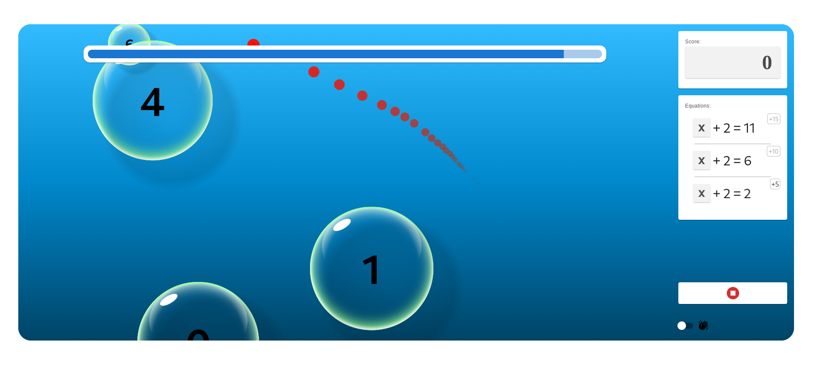
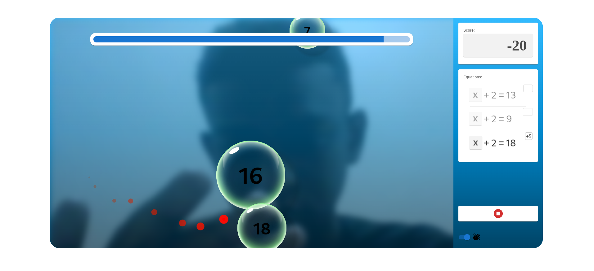

# A Simple Math Game + Hand Tracking

Solve the equations for <code>X</code> and pop the right bubbles. Get all the points you can in 60 seconds

* Use your mouse or 
* Use your hand (tracked by camera) to pop the bubbles!

OR

Resources:
* [Material UI](https://mui.com/) and [emotion](https://emotion.sh/) for the game UI
* [Mediapipe solutions](https://ai.google.dev/edge/mediapipe/solutions/guide) for the hand tracking